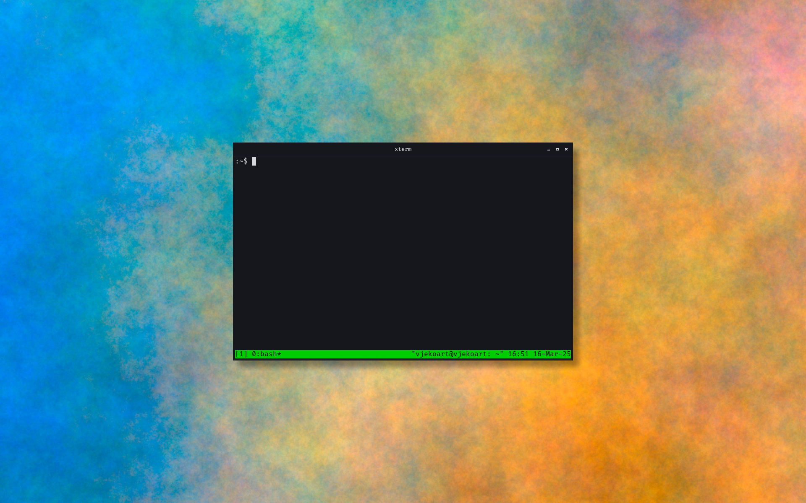
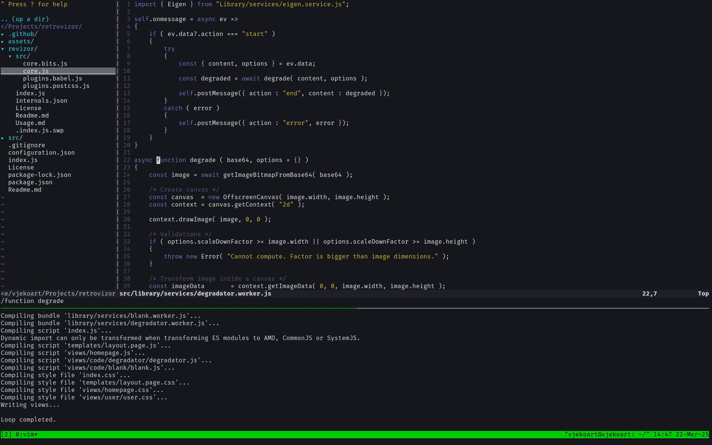

# Eigen UI

A holistic, and *very early* stage library of UI components for building web
interfaces, desktop PC interfaces, and a design system for both.

Vision: retro-futuristic machine-like interface with a touch of skeuomorphism,
with an eigengrau color as a base.

Status: a couple of theme and styling configurations for common nix* tools,
including Vim colorscheme.

---

Components:

* Visual and keybinding configuration for Debian (Trixie) using Xorg and
  Openbox, including fonts, terminal setup and window color scheme.
* Vim color scheme.
* Various scripts to easily reproduce and setup the OS.
    * Should be possible to reproduce following the documentation, but some
      local paths are hardcoded.
* Static website with skeuomorphism exploration.

## Roadmap

* Define a proper color scheme in the form of an HTML file
* Extend `themes/eigenui.vim` colorscheme that should also be used as a terminal color scheme
* Add IceCat and Chromium themes
* Keybinding: change active keymap, `setxkbmap us|hr`
* Introduce a background with minimal movement to create atmosphere, maybe only
  on the first desktop?
* ---
* Special keys: volume up|down, mute, brightness up|dowm, touchpad on|off, play/pause, next/prev
* Core feeling:
    * Home screen: time, battery, network/wifi, shutdown/restart/logout
    * Login screen
    * Screen lock
* Windows: custom icon pack with retro machine feeling
* Cursor:
    * Custom icon pack
    * Cursor disappears after a couple of seconds of inactivity
* Workspaces:
	* Defaults to 1 workspace
	* Each window in fullscreen mode becomes a standalone workspace
	* When exiting fullscreen a window is moved to the first workspace
    * In multiple monitor setup, changing of workspace moves only on the active
      screen

## Design system

* Typography
	* Fira Code as monospace, github.com/tonsky/FiraCode
	* Barlow as sans-serif, github.com/jpt/barlow
	* Gelasio as serif, github.com/SorkinType/Gelasio
* Base color: `#16161D`
* EigenUI, in `themes/EiegenUI`, linked with `~/.local/share/themes/EigenUI` folder
* Eigen theme for rofi in `dotfiles/config/rofi/eigen.rasi`
* eigenui colorscheme for vim in `themes/eigenui.vim`, enable by adding `colorscheme eigenui` to `.vimrc`

## Configurations and scripts

* See configuration files in `dotfiles` folder
* Script `setup.sh` creates all symbolic links in default location (~)

## Packages / Dependencies

* Xorg, `apt-get install xorg`
* Openbox, `apt-get install openbox`
* Xterm, `apt-get install xterm`
* rofi, `apt-get install rofi`
* tmux, `apt-get install tmux`
* compton, `apt-get install compton`
* hsetroot, `apt-get install hsetroot`

## Keybindings

* Switch between workspaces: Ctrl+Alt+<arrow-left|arrow-right>
* Run terminal: Super+e
* Xterm: toogle fullscreen: Alt+Enter
* Copy-paste (outside means non-terminal)
    * Copy from outside into terminal: select a text, Ctrl+c, click middle-mouse OR shift+insert in terminal to paste
    * Copy from terminal into outside: select a text, Ctrl+v outside terminal
    * Copy from terminal into termina: select a text, click middle-mouse OR shift+insert in terminal to paste

## Development notes

* XTerm is configured in `~/.Xresources`
* Reconfigure Openbox with `openbox --reconfigure`
* Keybindings are in `dotfiles/config/openbox/rc.xml`

